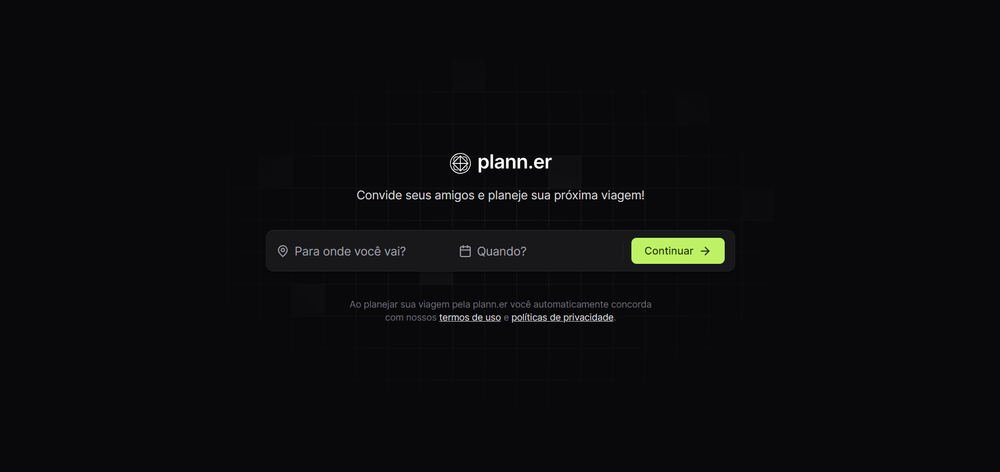
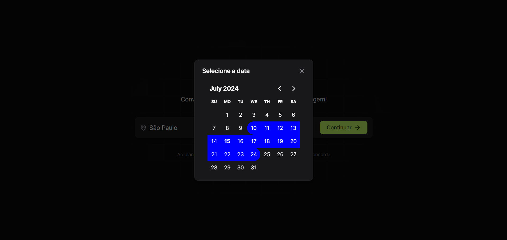
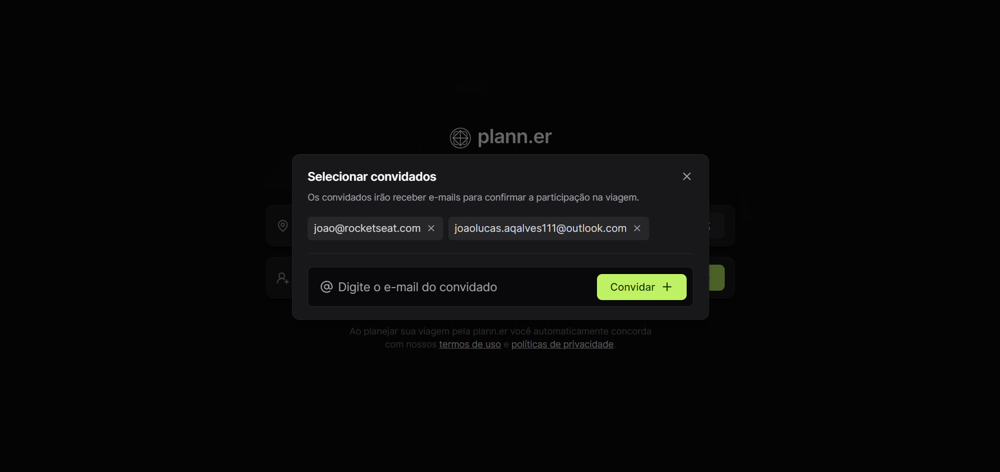
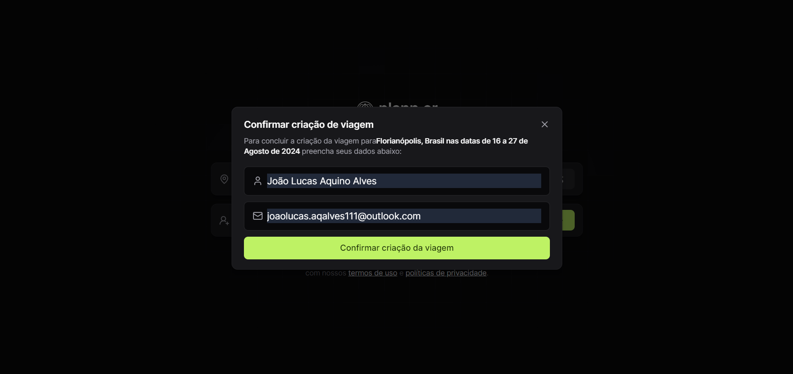
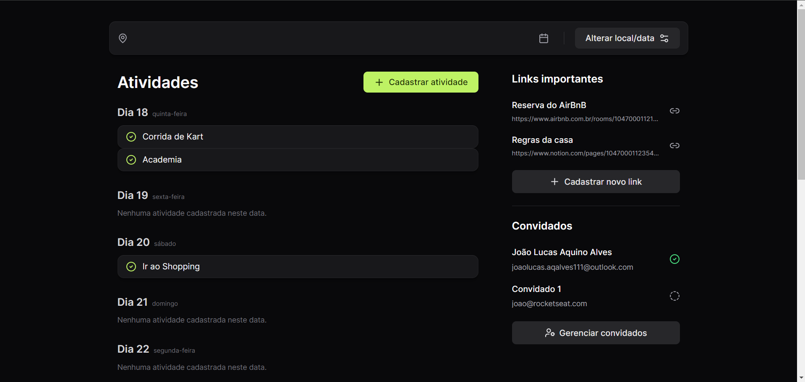
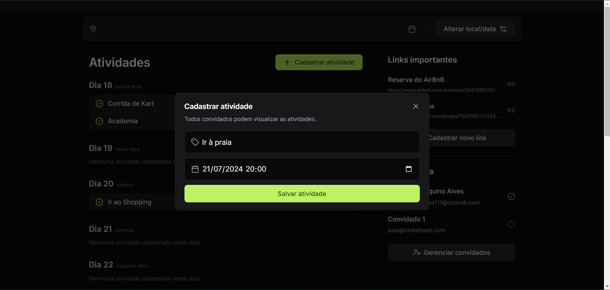

# Travel Planner Front

Este repositório armazena o **código frontend do projeto travel planner**, que consiste em um **aplicativo web, onde o usuário realiza o planejamento de suas futuras viagens**.
##### O usuário tem as opções:
- Escolher o destino da viagem, datas de ínicio e término; 
- Convidar conhecidos através de e-mails pré-estabelecidos pelo sistema;
- Quando ja escolhidas a opção de alterar destino e datas. 
##### Já com destino e datas decididos, o usuário é redirecionado à outra página onde tem as opções: 
- Cadastrar atividades a serem realizadas durante a viagem; 
- Cadastrar links como de hoteís e empresas de turismo;
- Verificar quais foram os convidados que confirmaram sua presença;

## Desafio do projeto
Este projeto foi selecionado pelo seu nível de complexidade, embora seja um simples aplicativo web, foram estudadas conexões do Front-End com o Back-End através de uma API e novas tecnologias.

  - Diferentes lógicas e organização de projeto com React.
  - Conhecimentos nas tecnologias Typescript e Tailwind CSS.

## Preview
### Home

### Trip

## Tecnologias utilizadas

